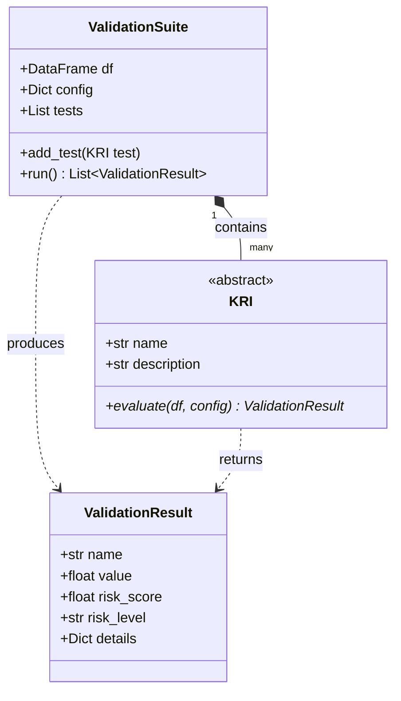

# Arquitetura do Projeto

O ModelSentry é desenhado com uma arquitetura modular focada em escalabilidade e manutenção simples.

## Componentes Principais

### 1. `core.base.KRI`
A classe abstrata que todos os testes (Key Risk Indicators) devem estender. 
Define o contrato de que cada teste deve implementar a função `evaluate`, que recebe um DataFrame e um dicionário de configuração e retorna um `ValidationResult`.

### 2. `core.base.ValidationResult`
A classe que padroniza o resultado retornado por qualquer KRI.
Ela garante que todo teste gere:
- O nome do teste.
- O valor bruto obtido.
- Um **`risk_score`** (0 a 100).
- Um **`risk_level`** derivado do score (Muito Baixo, Baixo, Médio, Alto, Crítico).
- Detalhes adicionais (thresholds usados, etc).

### 3. `core.suite.ValidationSuite`
É o motor central da biblioteca. O usuário instancia a `ValidationSuite` passando os dados e metadados, adiciona quantos KRIs quiser nela, e invoca o método `.run()`, que percorre todos os testes repassando os dados com segurança.

## Dimensões (Dimensions)

A biblioteca categoriza os testes fisicamente no diretório `dimensions/` separando qualitativos de quantitativos:
- **Qualitative**: Testes estruturais, tipos de dados e missings.
- **Quantitative**: Subdivididos por pilares analíticos:
  - `performance.py`: AUC, KS.
  - `stability.py`: PSI.
  - `methodology.py`: VIF.
