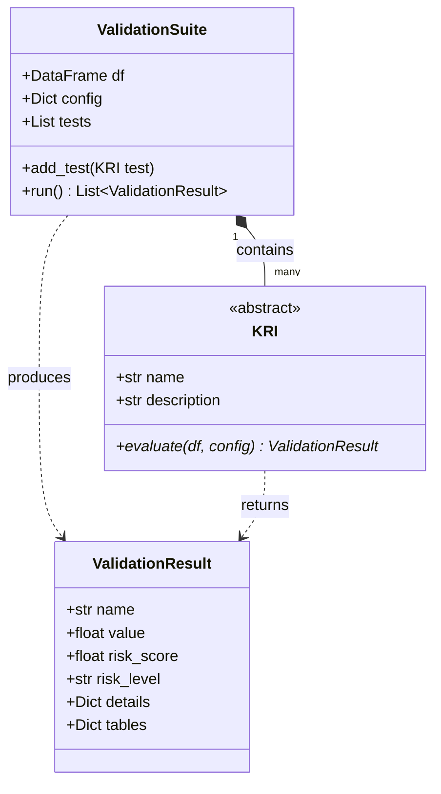

# Arquitetura do Projeto

O ModelSentry é desenhado com uma arquitetura modular focada em escalabilidade e manutenção simples.

## Componentes Principais

### 1. `core.base.KRI`
A classe abstrata que todos os testes (Key Risk Indicators) devem estender. 
Define o contrato de que cada teste deve implementar a função `evaluate`, que recebe um DataFrame e um dicionário de configuração e retorna um `ValidationResult`.

### 2. `core.base.ValidationResult`
A classe que padroniza o resultado retornado por qualquer KRI.
Ela garante que todo teste gere:
- O nome do teste.
- O valor bruto obtido.
- Um **`risk_score`** (0 a 100).
- Um **`risk_level`** derivado do score (Muito Baixo, Baixo, Médio, Alto, Crítico).
- Detalhes adicionais no dicionário `details` (thresholds usados, estatísticas auxiliares).
- Tabelas detalhadas no dicionário `tables` (instâncias de Pandas DataFrame contendo métricas granulares como PSI por safra, distribuíções, etc).

### 3. `core.suite.ValidationSuite`
É o motor central da biblioteca. O usuário instancia a `ValidationSuite` passando os dados e metadados, adiciona quantos KRIs quiser nela, e invoca o método `.run()`, que percorre todos os testes repassando os dados com segurança.

## Dimensões (Dimensions)

A biblioteca categoriza os testes fisicamente no diretório `dimensions/` separando qualitativos de quantitativos:
- **Qualitative**: Testes estruturais, tipos de dados e missings.
- **Quantitative**: Subdivididos por pilares analíticos:
  - `performance.py`: AUC, KS.
  - `stability.py`: PSI.
  - `methodology.py`: VIF.

## Camadas de Saída e Relatórios

### 1. Camada de Visualização (`viz.plots`)
As funções de plot, como `plot_kri_summary` e `plot_psi_mensal`, não recalculam nenhuma métrica. Elas recebem como entrada o `ValidationResult` processado pelo KRI e extraem os dados agregados ou detalhados (diretamente do atributo `tables`) para gerar os gráficos. Essa separação garante que a lógica analítica fique isolada nos KRIs.

### 2. Camada de Relatórios (`reporting.generator`)
A função `generate_html_report` consome a lista de resultados e gera um relatório executivo. A mágica da arquitetura se consolida aqui:
O gerador varre os resultados e, de maneira automatizada, injeta os gráficos gerados e itera sobre o atributo `tables` de cada `ValidationResult` para renderizá-las em HTML (`.to_html()`).

Desta forma, **qualquer novo KRI** que precisar exibir dados granulares (como tabelas por decil, histórico por safra, etc) só precisa anexar um Pandas DataFrame no dicionário `tables` do seu resultado. O ModelSentry irá, automaticamente, apresentá-lo no HTML final, sem que nenhuma alteração precise ser feita no gerador do relatório.
