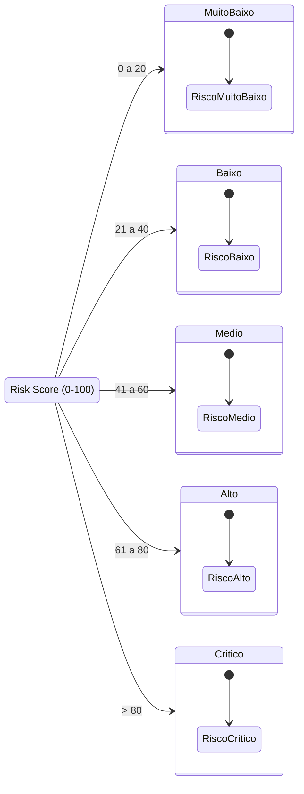

# Guia para Desenvolvedores e Contribuição

Bem-vindo(a) ao guia de desenvolvimento do ModelSentry! Este documento te guiará sobre como manter e expandir o projeto.

## Gerenciamento de Dependências

O projeto utiliza `uv` para gestão de pacotes e virtualenvs.

Para instalar as dependências e o pacote localmente, basta rodar:
```bash
uv add pandas pytest
uv add --dev jupyter
```

Para rodar os testes:
```bash
uv run pytest tests/
```

## Como a Lógica de Risco (Risk Score) Funciona

O ModelSentry trabalha com o conceito de `risk_score` variando de 0 (melhor cenário) a 100 (pior cenário).
Este score alimenta dinamicamente a propriedade `risk_level` do `ValidationResult`.



Estes são os cinco grandes blocos:
- `<= 20`: **Muito Baixo**
- `<= 40`: **Baixo**
- `<= 60`: **Médio**
- `<= 80`: **Alto**
- `> 80`: **Crítico**

## Adicionando Novos KRIs

Qualquer novo indicador que você quiser criar deve estender a classe `KRI` e implementar o método `evaluate`.

### Passo a Passo

1. **Escolha o arquivo adequado**: Se for um teste de drift, vá em `stability.py`. Se for um teste lógico (ex: regras de negócio), crie ou adicione em um arquivo adequado dentro de `dimensions/qualitative`.
2. **Herdar KRI**:
```python
from modelsentry.core.base import KRI, ValidationResult
import pandas as pd

class NovoKRI(KRI):
    def __init__(self, limit: float):
        super().__init__(name="Meu Novo Teste", description="Testa algo legal")
        self.limit = limit
        
    def evaluate(self, df: pd.DataFrame, config: dict) -> ValidationResult:
        # 1. Calcule seu valor
        valor = 0.5 
        
        # 2. Defina a lógica de cálculo do risk_score de 0 a 100 baseado no limit
        risk_score = 0.0 # implementar proporcionalidade!
        
        # 3. Retorne ValidationResult
        return ValidationResult(
            name=self.name,
            value=valor,
            risk_score=risk_score,
            details={"limite_usado": self.limit}
        )
```
3. **Crie um Teste**: Vá na pasta `tests/` e instancie seu KRI simulando os dados para garantir que a proporcionalidade do score ocorre conforme esperado.
