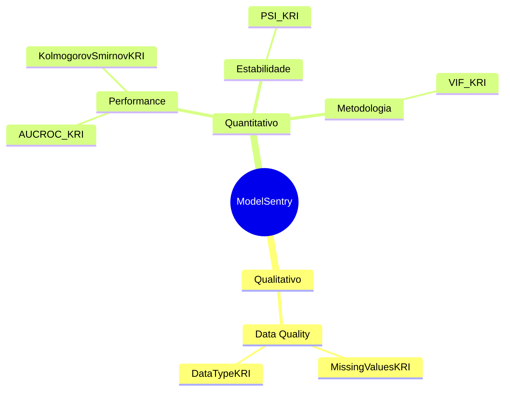

# ModelSentry Documentation

Bem-vindo à documentação oficial do **ModelSentry**, a biblioteca guardiã para monitoramento e validação de modelos de Machine Learning.

O ModelSentry ajuda você a garantir a estabilidade, performance e qualidade metodológica e de dados de seus modelos em produção através de uma suíte de validação customizável com análise de níveis de risco dinâmicos.

## Visão Geral das Dimensões

## Sumário

- [Arquitetura](architecture.md)
- [Guia de Contribuição e Manutenção](contributing.md)

### Dimensões & KRIs

- **Data Quality (Qualitativo)**: [MissingValuesKRI e DataTypeKRI](kris/data_quality.md)
- **Performance (Quantitativo)**: [AUCROC_KRI e KolmogorovSmirnovKRI](kris/performance.md)
- **Estabilidade (Quantitativo)**: [PSI_KRI](kris/stability.md)
- **Metodologia (Quantitativo)**: [VIF_KRI](kris/methodology.md)
